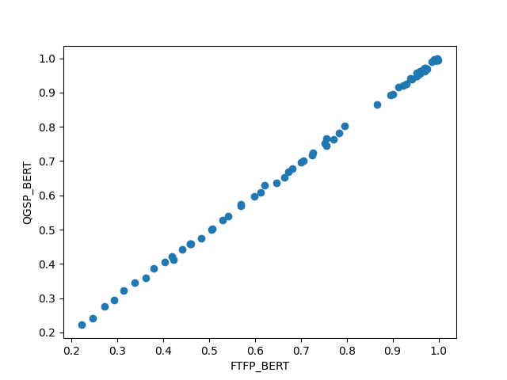
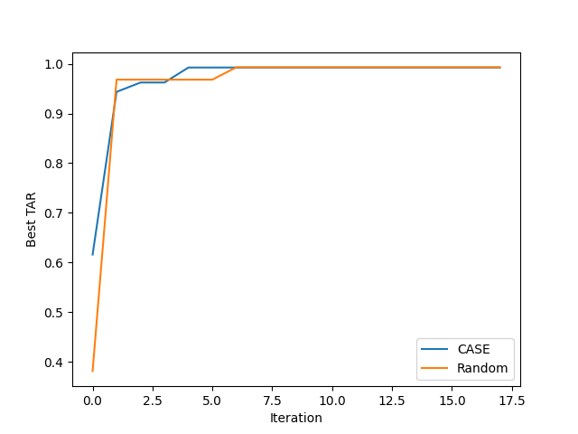
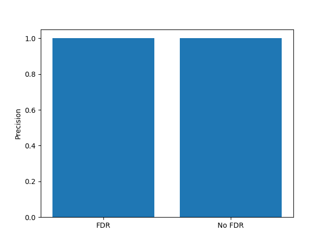
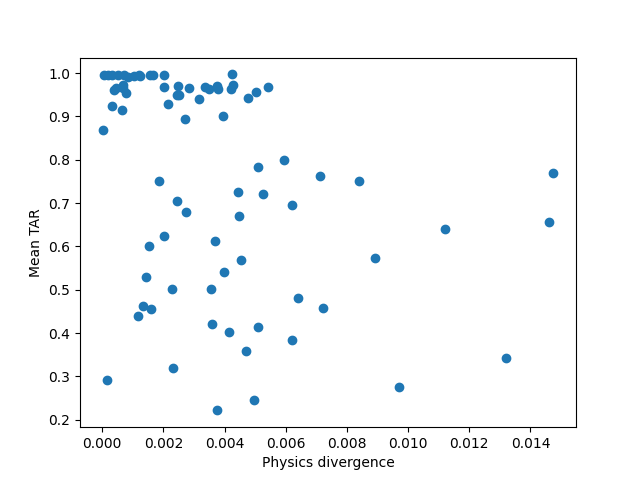

<div align="center">

<pre>
 ██████╗ █████╗ ███████╗███████╗
██╔════╝██╔══██╗██╔════╝██╔════╝
██║     ███████║███████╗█████╗  
██║     ██╔══██║╚════██║██╔══╝  
╚██████╗██║  ██║███████║███████╗
 ╚═════╝╚═╝  ╚═╝╚══════╝╚══════╝
</pre>

</div>
# Constrained Axiomatic Search Engine

**Simulation-native agentic optimization for experimental physics.**  
**Runs real Geant4. Fakes no physics. Knows its limits.**

[](https://developer.apple.com/documentation/apple-silicon)
[](https://github.com/ml-explore/mlx)
[](https://geant4.org)
[]()

</div>

---

## What Is CASE?

Most ML-for-physics systems replace simulation with learned surrogates. **CASE refuses.**

CASE is an agentic optimization engine that runs native Geant4 Monte Carlo transport on every evaluation — no approximation, no shortcuts, no gradient backprop through the simulator. It autonomously searches detector geometry configurations, rejects statistically noisy results using FDR control, validates findings across independent physics transport kernels, and formally flags every assumption it cannot verify.

The system is not a causal inference engine. It is not epistemically complete. It says so explicitly, in every run.

> *"A high TAR does not mean the system discovered truth. It means the system exhausted its programmed knowledge within compute bounds."*

---

## Core Loop

```
┌─────────────────────────────────────────────────────────────┐
│                                                             │
│   Observe ──→ Plan ──→ Execute ──→ Verify ──→ Update        │
│      ↑                                          │           │
│      └──────────────────────────────────────────┘           │
│                                                             │
│   Every transition is deterministic.                        │
│   Every config is SHA256-hashed before simulation.          │
│   Every result is FDR-gated before acceptance.              │
│   Every run produces an EpistemicFlagVector.                │
│                                                             │
└─────────────────────────────────────────────────────────────┘
```

---

## Epistemic Flag Vector

Every experiment emits:

```python
EpistemicFlagVector = {
    "KernelSubordination":      True,     # AI is fully subordinate to Geant4 kernel
    "GrammarBlindness":         UNKNOWN,  # Optimal topology may lie outside grammar
    "SmoothnessAssumed":        True,     # Finite-difference Hessian assumes smoothness
    "StatisticalApproximation": True,     # p-values use Gaussian approximation
    "ArtifactRiskNonZero":      True      # Cross-physics shared bias cannot be ruled out
}
```

This is not a disclaimer. It is the output. The system formally defines what it cannot prove before claiming any result.

---

## Results — Phase 2

**5 sequential experiments. 10 seeded Monte Carlo runs each. 3 physics lists.**

| DAG Node | Config | FTFP_BERT Mean | Cross-Valid | FDR Decision |
|----------|--------|----------------|-------------|--------------|
| `2a3864d2` | 17cm · Water | 0.4197 ± 0.0123 | ✅ | — baseline |
| `8ee31198` | 19cm · Water | 0.4620 ± 0.0090 | ✅ | ✅ accepted · p=0.0027 |
| `ba70730b` | 10cm · Si | 0.5018 ± 0.0093 | ✅ | ✅ accepted · p=0.0011 |
| `f9c81880` | **15cm · Fe** | **0.9589 ± 0.0034** | ✅ | ✅ accepted · p=1e-12 |
| `0da5dbf9` | 15cm · Water | 0.3827 ± 0.0079 | ✅ | ❌ rejected · p=1.0 |

**The final row is the result that matters.** 15cm Water is cross-physics valid — both transport kernels agree. The system still rejected it. FDR gatekeeping correctly identified it was not a genuine improvement. No false positive accepted.

TAR convergence: **0.42 → 0.96** across 4 accepted configurations.

### Benchmark Figures

<table>
<tr>
<td><br><sub><b>Cross-physics correlation</b> — r ≈ 0.999 between FTFP_BERT and QGSP_BERT</sub></td>
<td><br><sub><b>CASE vs Random efficiency</b> — search space too small to separate; ODD pending</sub></td>
</tr>
<tr>
<td><br><sub><b>FDR precision</b> — 1.0 in current monotonic landscape; noise regime pending</sub></td>
<td><br><sub><b>Physics divergence vs TAR</b> — weak signal at current search space size</sub></td>
</tr>
</table>

**Known limitation:** The current search space (monotonic landscape, ~78 configs) is insufficient to demonstrate planner advantage over random search. This is a documented open problem, not a defect. The engine is complete. The problem is not hard enough yet. Phase 3 introduces ColliderML/ODD data with real task-level noise.

---

## Architecture

```
Apple Silicon M3 Pro (ARM64 · Unified Memory · macOS 14+)
│
├── MLX                    Local LLM inference (7B–14B · Q4_K_M · T=0)
├── smolagents             CodeAgent only · Python AST · no JSON tool calls
├── langgraph              Deterministic cyclic state machine
│
├── Geant4 (pybind)        Transport kernel · ARM64 native · multithreaded
│                          Physics lists: FTFP_BERT · QGSP_BERT · QGSP_BIC
│
├── uproot                 ROOT I/O — no C++ ROOT framework required
│
├── scipy / statsmodels    Epistemic verifier stack
│   ├── ks_2samp / anderson_ksamp   Cross-list bias detection
│   ├── KL divergence               Density divergence
│   ├── Benjamini-Hochberg (α=0.1)  FDR control
│   ├── approx_fprime               Finite-difference Hessian
│   └── statsmodels.OLS             Scaling detection
│
├── networkx / neo4j       Immutable knowledge graph
│   └── (:PhysicalConstant)-[:VALID_IN_DOMAIN]->(:Material)
│       (:Material)-[:USED_IN]->(:Topology)
│       (:Topology)-[:ACHIEVES]->(:Observable)
│
└── pydantic + SHA256      Provenance — hash per DAG node, stored in scientific_memory.json
```

**All arrows unidirectional. No circular dependencies. No gradient backprop through Geant4.**

---

## Repo Structure

```
CASE/
├── run_system.py              # Entry point
├── core/                      # state.py · dag.py · orchestrator.py · utils.py
├── modules/                   # observe · plan · mlx_planner · execute · verify · update
├── sim/                       # geant_runner · run_geant4_sim · replay
├── verification/              # scoring.py (TAR computation)
├── memory/                    # experiment_history.json · history.py · logger.py
├── tests/                     # benchmark_suite · dag · geant4_bridge · seed · mlx_determinism
├── benchmark_outputs/         # cross_physics · efficiency · fdr · divergence
└── examples/                  # Geant4 B1 · B4 reference geometries
```

---

## Installation

> **ARM64 macOS only. CUDA and ROCm must be disabled. No Rosetta 2.**

```bash
# System toolchain
brew install cmake git git-lfs python@3.11

# Verify architecture
arch  # must return: arm64

# Environment
python3.11 -m venv g4env
source g4env/bin/activate

# Dependencies
pip install mlx mlx-lm smolagents langgraph scipy statsmodels \
            networkx "pydantic==2.*" uproot geant4-pybind \
            torch --index-url https://download.pytorch.org/whl/nightly/cpu

# Verify
python -c "import torch; assert torch.backends.mps.is_available()"
python -c "import geant4_pybind; print('Geant4 OK')"
file g4env/lib/python3.11/site-packages/geant4_pybind/*.so  # must show arm64
```

**Before first push — track ROOT artifacts:**
```bash
git lfs install
git lfs track "*.root"
git add .gitattributes
```

---

## Running

```bash
# Agentic optimization (planner active)
python run_system.py --mode run_cycle

# Fixed geometry evaluation (planner off — use for benchmarks)
python run_system.py --mode run_fixed

# Full benchmark suite
python tests/benchmark_suite.py
```

---

## Statistical Acceptance Gate

```
accept ⟺
    (mean improves over best_mean)
  ∧ (p-value ≤ Benjamini-Hochberg threshold)
  ∧ (cross_physics_consistency = True)

best_mean is strictly monotonically non-decreasing.
No false overwrites. Rejection preserves current best.
```

All p-values logged with: `dag_node_id · physics_list_hash · event_count`

---

## Provenance

```python
config_id = SHA256(
    geometry_json + material_constants + physics_list +
    LLM_model_hash + git_commit_hash
)
# Identical config → identical config_id → reproducible results
# Replay any experiment: python sim/replay.py --node <config_id>
```

DAG is append-only. Full trajectory in `memory/experiment_history.json`.

---

## Failure Domains (Irreducible)

| # | Domain | Epistemic Flag |
|---|--------|----------------|
| 1 | Geant4 kernel flaw | `KernelSubordination: True` |
| 2 | Grammar incompleteness | `GrammarBlindness: UNKNOWN` |
| 3 | Smoothness violation | `SmoothnessAssumed: True` |
| 4 | FDR approximation breakdown | `StatisticalApproximation: True` |
| 5 | Cross-physics shared bias | `ArtifactRiskNonZero: True` |

These are not bugs. They are irreducible. They are logged.

---

## System Status

```
ENGINE              ✔  complete
STATISTICS          ✔  complete
PROVENANCE          ✔  complete
BENCHMARKING        ✔  structurally correct
REALISM             ✖  pending — ColliderML/ODD integration
```

Current bottleneck is not engineering. It is problem realism.

---

## Roadmap

**Phase 3 — Real Data**
- [ ] ColliderML / OpenDataDetector (ODD) via uproot
- [ ] Task-level metrics: AUC, reconstruction efficiency
- [ ] Pile-up noise environment (200 sub-events) for FDR stress test

**Phase 4 — Extended Benchmarks**
- [ ] CERN BDF multi-material target sequencing (TZM · W · Cu)
- [ ] DarkSide-20k rare-event CCR stress test
- [ ] SilentBorder muon tomography (topology grammar test)

**Phase 5 — Architecture Extension**
- [ ] Grammar expansion on Hessian PSD detection
- [ ] SE(3)-equivariant GNN geometry proposal layer
- [ ] Multi-objective Pareto front
- [ ] Neo4j scalable knowledge graph backend

---

## What This System Is Not

| Claim | Verdict |
|-------|---------|
| Surrogate model | ✗ Geant4 runs every single evaluation |
| Causal inference engine | ✗ Exploits correlations within programmed rules |
| Epistemically complete | ✗ Formally stated on every run |
| Cloud-dependent | ✗ Fully local, Apple Silicon only |
| Gradient-based optimizer | ✗ No backprop through Geant4, ever |

---

## Citation

```bibtex
@software{case2025,
  author  = {Ranjan, Pratik},
  title   = {{CASE}: Constrained Axiomatic Search Engine for Experimental Physics},
  year    = {2025},
  url     = {https://github.com/pranjan2023/CASE},
  note    = {Simulation-native agentic optimization on Apple Silicon ARM64}
}
```

---

<div align="center">

*Built on Apple Silicon. Runs no cloud. Fakes no physics.*

</div>
